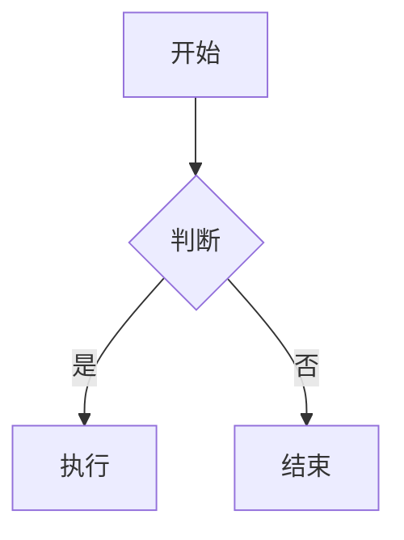

# 复杂测试文档

**文档版本**：v3.2.1

## 概述

这是一个包含多种 Markdown 元素的复杂文档。

## 代码块

```javascript
function hello() {
    console.log("Hello, World!");
}
```

```python
def greet(name):
    return f"Hello, {name}!"
```

## 表格

| 列1 | 列2 | 列3 |
|-----|-----|-----|
| A   | B   | C   |
| D   | E   | F   |

## 数学公式

行内公式：$E = mc^2$

块级公式：

$$
\int_{0}^{\infty} e^{-x^2} dx = \frac{\sqrt{\pi}}{2}
$$

## Mermaid 图表



## 列表

- 项目一
  - 子项目 1.1
  - 子项目 1.2
- 项目二
- 项目三

1. 有序项一
2. 有序项二
3. 有序项三

## 引用

> 这是一段引用文本。
> 包含多行内容。

## 图片引用


## HTML 标签

<details>
<summary>点击展开</summary>

这是折叠内容。

</details>

## 总结

本文档用于测试各种 Markdown 元素的渲染和批注功能。
