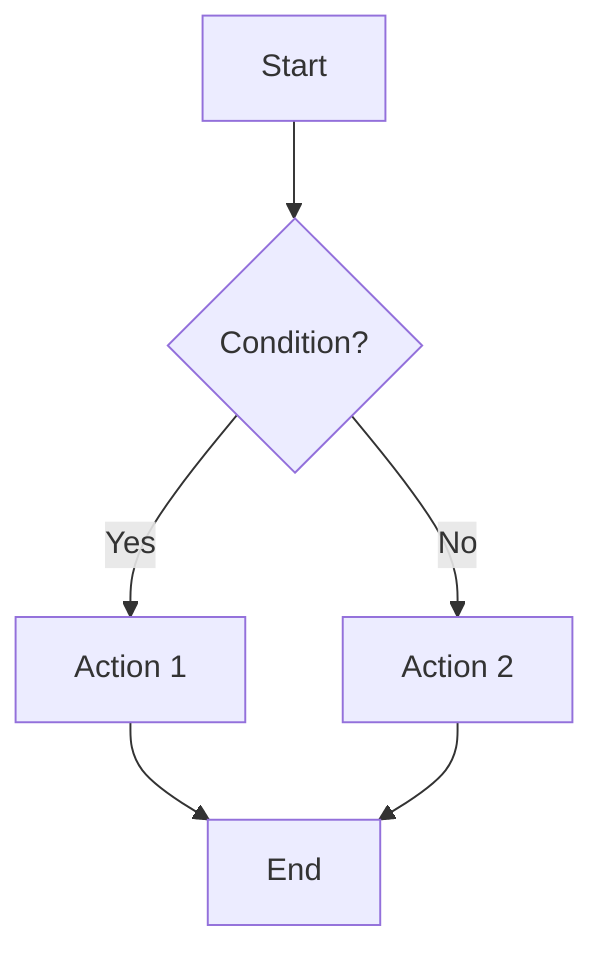
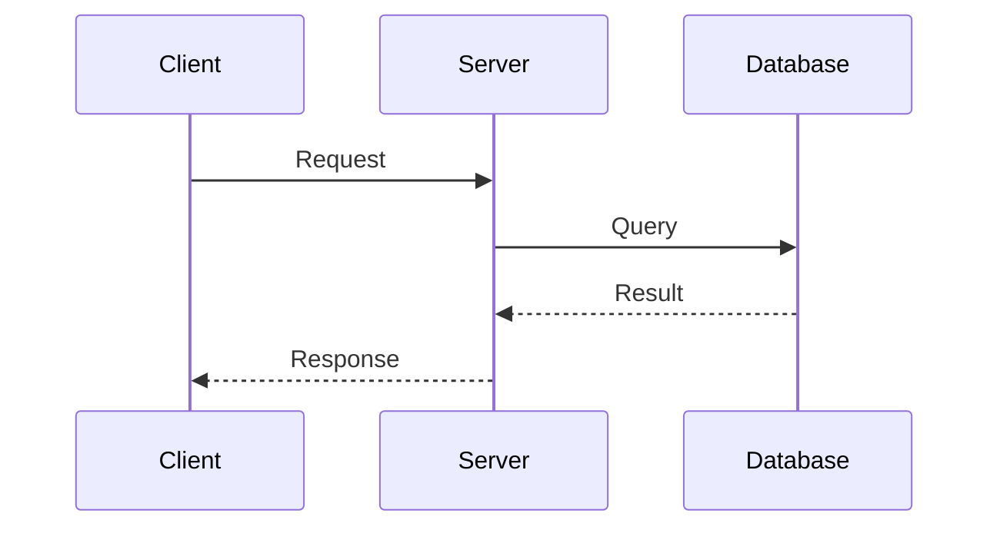
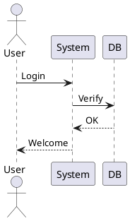
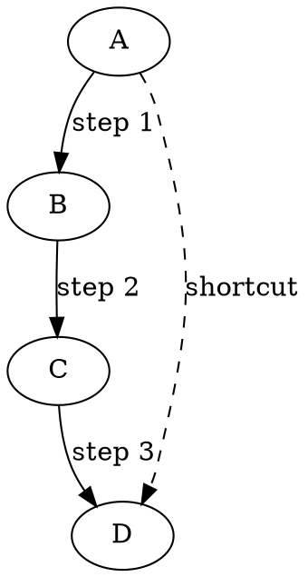
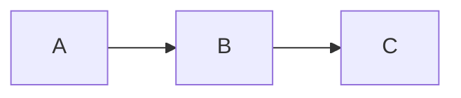
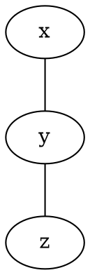

# Diagrams Mixed Fixture

## Mermaid 流程图

```mermaid
flowchart TD
    A[Start] --> B{Condition?}
    B -->|Yes| C[Action 1]
    B -->|No| D[Action 2]
    C --> E[End]
    D --> E
```

## Mermaid 时序图

```mermaid
sequenceDiagram
    Client->>Server: Request
    Server->>Database: Query
    Database-->>Server: Result
    Server-->>Client: Response
```

## PlantUML 用例图

```plantuml
@startuml
actor User
User -> System : Login
System -> DB : Verify
DB --> System : OK
System --> User : Welcome
@enduml
```

## Graphviz DOT

```dot
digraph G {
    A -> B [label="step 1"];
    B -> C [label="step 2"];
    C -> D [label="step 3"];
    A -> D [label="shortcut", style=dashed];
}
```

## 连续图表

```mermaid
graph LR
    A --> B --> C
```

```dot
graph H {
    x -- y -- z;
}
```
