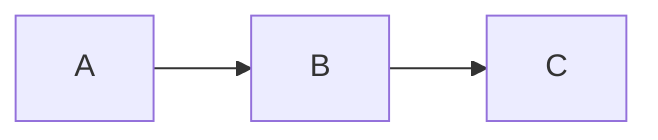

# Mixed Everything — 综合场景交叉

本 fixture 是 V1/V2/V3a/V3b/D4 全部修补的综合回归场景。一次 open-save 应零-diff。

## 1. 正文含特殊字符

使用 * 号、_ 下划线、# 井号、| 管道、$ 美元、\ 反斜杠 等字符。

Windows 路径：`C:\Users\letichen\Projects\md-review-tool\README.md`。

## 2. 列表混合

- 第一级
  - 第二级 A
    1. 有序子项 1
    2. 有序子项 2
- [ ] 待办
- [x] 已办
  - [ ] 子待办

## 3. 表格（对齐 + 换行 + 行内）

| Left | Center | Right |
| :--- | :---: | ---: |
| **bold** | *italic* | `code` |
| line1  line2 | x | 123 |
|  | empty | - |

## 4. 代码块

```typescript
const msg = "C:\\Users\\foo";
console.log(`Path: ${msg}`);
```

## 5. 数学

行内 $E = mc^2$，块级：

$$
\int_0^1 f(x) \, dx
$$

## 6. 图表



## 7. 告警

> [!NOTE]
> 这里面有 **加粗** 和 `代码` 和 <kbd>Ctrl</kbd>。

## 8. 颜色 + 语义标签

按 <kbd>Ctrl</kbd>+<kbd>C</kbd> 复制，文字 {color:red}红色{/color}，==高亮==，H~2~O，E=mc^2^，<u>下划线</u>，~~删除线~~，++新增++。

## 9. 链接

[GitHub](https://github.com "Hover title")，[相对路径](./plain-prose.md)。

## 10. 图片

图片不存在但结构合法：。
