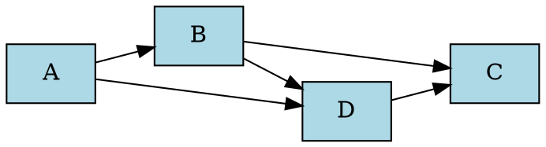
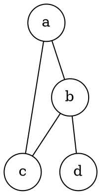

# Graphviz 图表测试

## 有向图

```graphviz
digraph G {
    rankdir=LR;
    node [shape=box, style=filled, fillcolor=lightblue];
    A -> B -> C;
    A -> D -> C;
    B -> D;
}
```

## 无向图

```graphviz
graph G {
    node [shape=circle];
    a -- b;
    b -- c;
    c -- a;
    b -- d;
}
```

## 语法错误（降级测试）

```graphviz
digraph INVALID {
    This is not valid -> -> -> DOT syntax
    {{{
```
