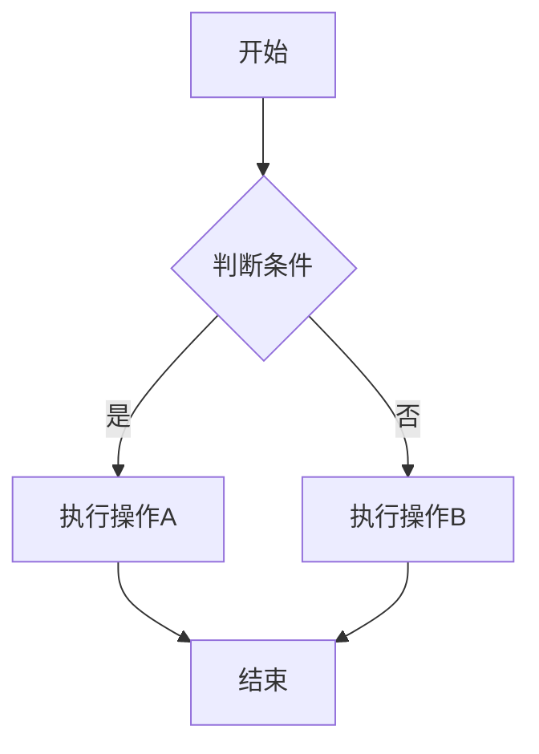
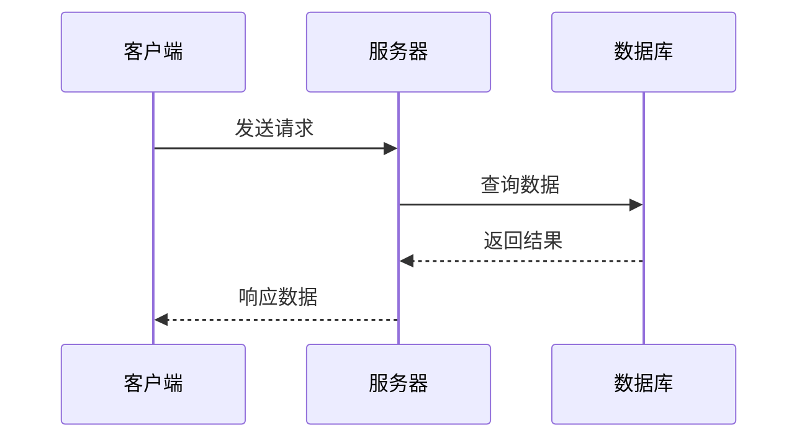

# Mermaid 图表测试

## 流程图

```mermaid
graph TD
    A[开始] --> B{判断条件}
    B -->|是| C[执行操作A]
    B -->|否| D[执行操作B]
    C --> E[结束]
    D --> E
```

## 时序图

```mermaid
sequenceDiagram
    participant 客户端
    participant 服务器
    participant 数据库
    客户端->>服务器: 发送请求
    服务器->>数据库: 查询数据
    数据库-->>服务器: 返回结果
    服务器-->>客户端: 响应数据
```

## 语法错误（降级测试）

```mermaid
graph INVALID
    This is not valid mermaid syntax >>>
```
